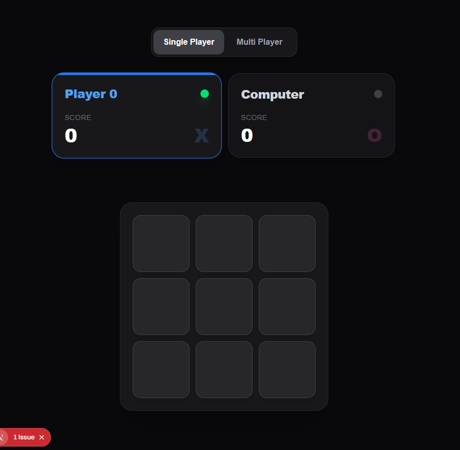
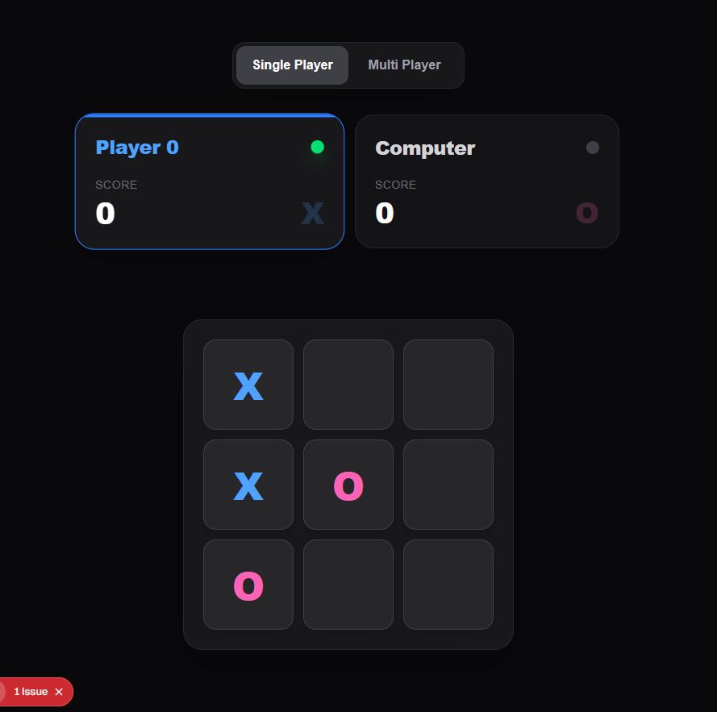
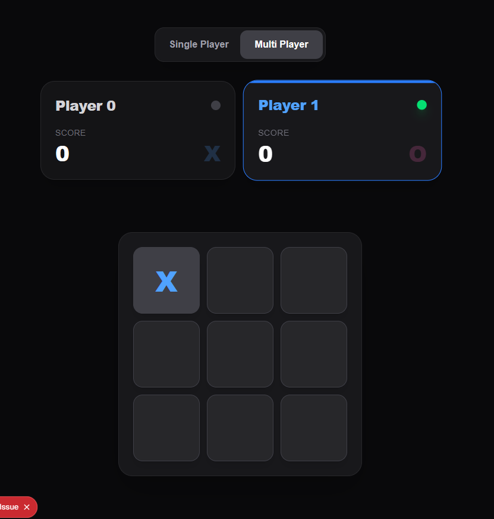
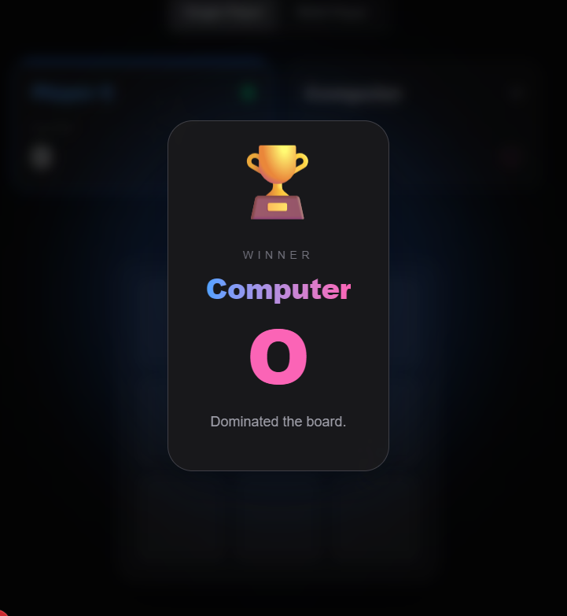

# 🎮 Tic Tac Toe

A modern and responsive Tic Tac Toe game built using Next.js, React, TypeScript, and Tailwind CSS.

<table>
  <tr>
    <td>
      
    </td>
    <td>
      
    </td>
  </tr>
  <tr>
    <td></td>
    <td></td>
  </tr>
  </table>

The project supports:
- 👥 Multiplayer mode
- 🤖 Single player mode against computer
- 🏆 Winner celebration UI
- ⚡ Responsive modern UI
- 🎨 Animated game interactions
- 🧠 Smart move detection logic


# ✨ Features

## 🎯 Gameplay
- Classic 3x3 Tic Tac Toe board
- Turn-based gameplay
- Automatic winner detection
- Score tracking system
- Active player highlighting
- Board reset after winner announcement


## 👤 Multiplayer Mode
Play locally with 2 players on the same device.


## 🤖 Computer Mode
Play against a simple computer opponent.

Current computer strategy:
- Winning move detection
- Blocking opponent moves
- Center prioritization
- Random fallback moves


## 🎨 UI Features
- Fully responsive layout
- Dark modern gaming aesthetic
- Animated winner modal
- Smooth hover transitions
- Glassmorphism-inspired cards
- Dynamic player indicators


# 🛠️ Tech Stack

- Next.js
- React
- TypeScript
- Tailwind CSS


# 📂 Project Structure

```bash
app/
│
├── components/
│   ├── Squares.tsx
│   ├── MultiPlayerToggleButton.tsx
│   └── Todo.tsx
│
├── contexts/
│   └── ticTacToe.context.tsx
│
└── page.tsx
